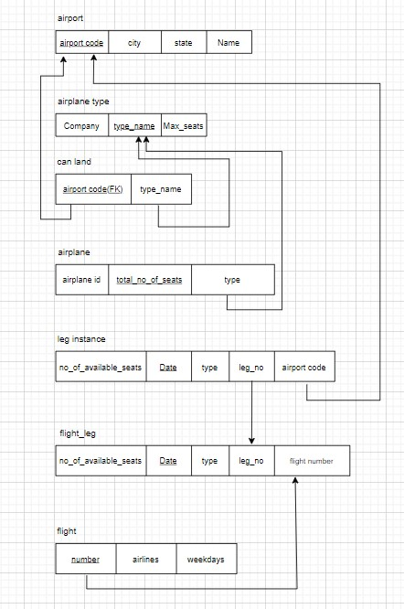
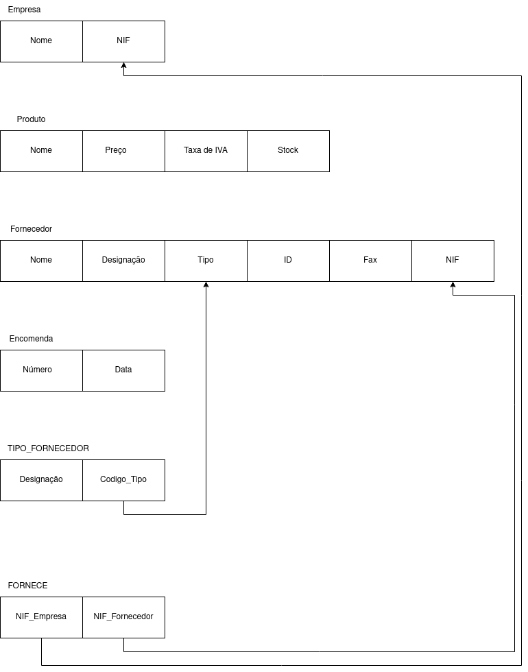
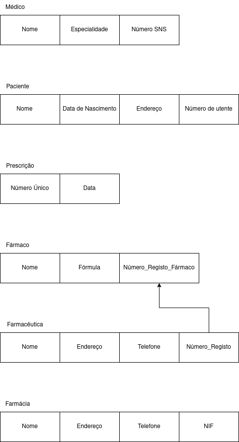
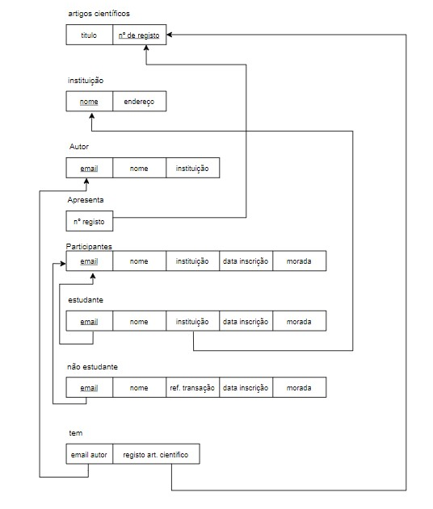
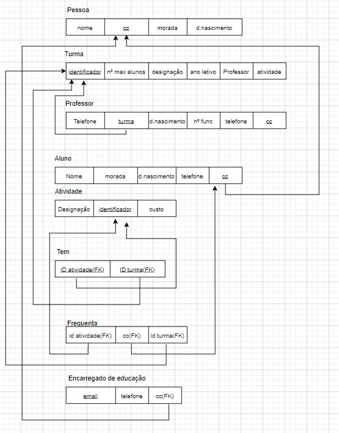

# BD: Guião 3


## ​Problema 3.1
 
### *a)*

```
Cliente, Balcão, Veículo, Aluguer, Tipo de veiculo,similaridade, ligeiro, pesado
```


### *b)* 

```
Cliente -> PK : NIF

Balcão -> PK : número

veículo -> PK: matricula

ALuguer -> PK : número
		FK : cliente, balcão, veiculo

tipo de veiculo -> PK : código
			   FK : código

Similaridade -> FK : tipo1, tipo2

ligeiro -> FK : tipo

pesado -> FK : tipo  

```


### *c)* 


## ​Problema 3.2

### *a)*

```
Relações: airport , airplane type, can_land,airplane, leg instance, flight leg, flight
```


### *b)* 

```
Chaves primárias: 
aiport : airport_code
airplane_type : type_name
airplane: total_no_of_seats
leg instance : date
flight_leg: flight number

Chaves estrangeiras:
can_land: airport code, type name
airplane: type
leg instance : leg_no
flight_leg: leg_no
flight: number

```


### *c)* 




## ​Problema 3.3


### *a)* 2.1



### *b)* 2.2



### *c)* 2.3



### *d)* 2.4

